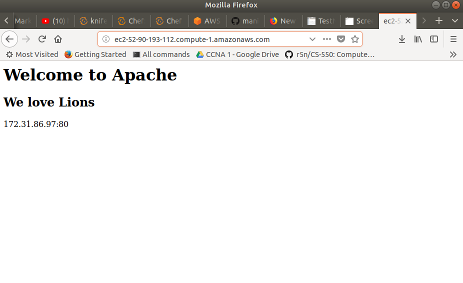
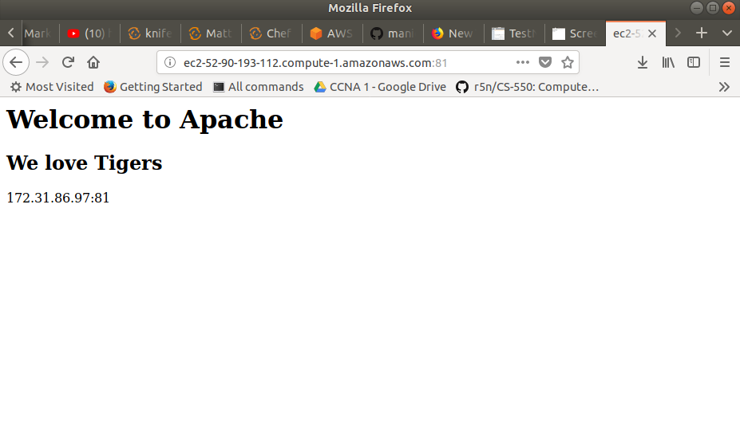
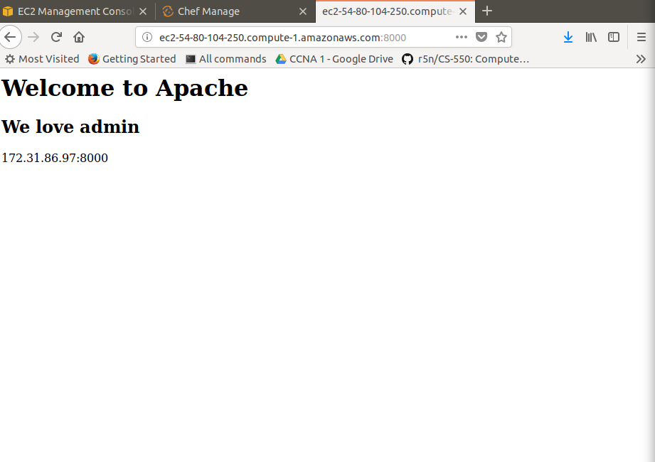
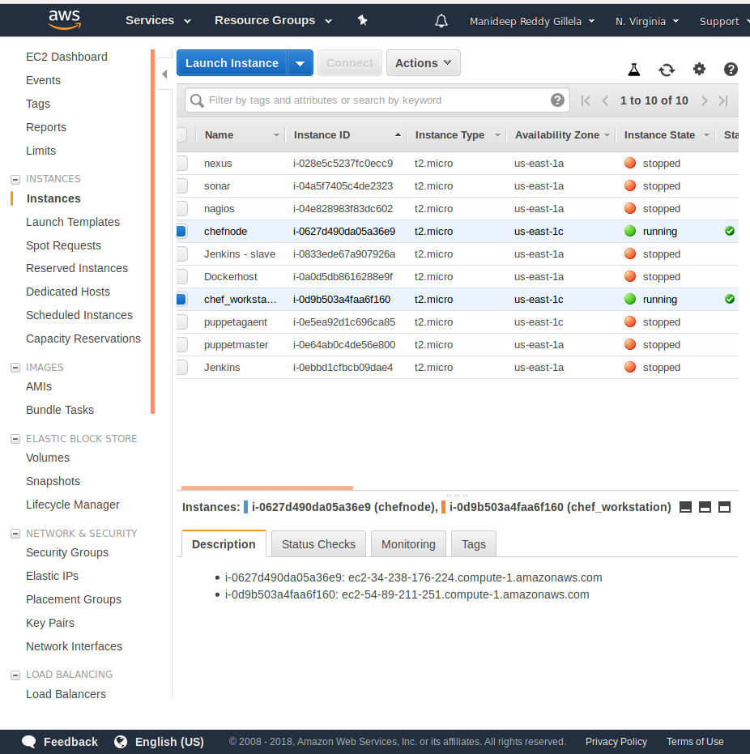
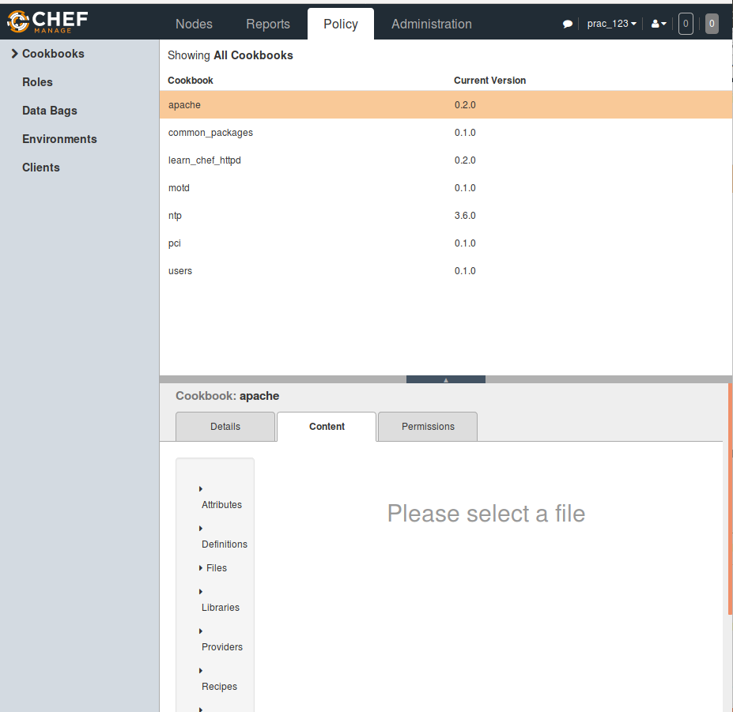
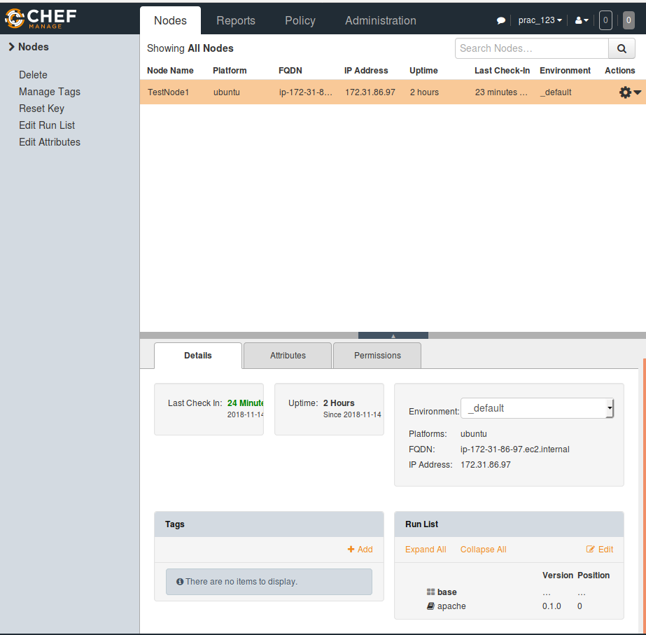

# Apache by Chef

Configured Apache Web Server on a node server to display three different websites on three different ports using configuration management tool(Chef).

## Prerequisites

Here we require three servers:
1. Chef-Server
2. Workstation
3. Node server

We can use AWS ec2-instances or any virtual machines for the servers or for chef-server, we can use hosted version of official chef-sever and download the starter-kit to worksation after creating an organisation in chef-server.

We are using AWS ec2-linux(Ubuntu 14.04) instances for worksation and node server. And a hosted version of chef-server. 

Please read [Chef Docs](https://docs.chef.io/). for setting up workstation, chef-server, chef-client on node and other concepts.
## Getting started

We follow the following steps:
1. Create a new cookbook in chef_repo/cookbooks
2. Write recipe for apache2 in ruby
3. Write required attributes and templates
4. Assign role to runlist of node
5. upload cookbook to chef-server
6. run chef-client on node

Now we will execute the above steps:
1. Create a cookbook in chef_repo/cookbooks directory. We Will get a directory structure created with some other files like recipes, attributes, files, templates etc.
Use the following command to create cookbook:
```
$ knife cookbook create apache2
        or
$ Chef generate cookbook apache2  (for newer chef versions)
```
2. Please refer cookbooks/apache/recipes/default.rb for the recipe.
In this we write multiple resources:

- Install apache:
   we define a package called "apache2"
```
package "apache2" do
  action :install
end
```

- Disable virtual host:
  We need to disable vistual host, which is nothing but a default home page displayed by Apache. To disable, we simply rename the file name to default.conf.disabled.
We use "execute" resource here. Execute resource performs whatever users pass.Here, execute is not idempotent i.e it does not work multiple times. So, we use guards like only_if or not_if to prevent from errors.

```
execute "mv /etc/apache2/sites-enabled/000-default.conf /etc/apache2/sites-enabled/000-default.conf.disabled"  do
  only_if do
    File.exist?("/etc/apache2/sites-enabled/000-default.conf")
  end
  notifies :restart, "service[apache2]"
end
```
Resource executes only if "only_if" condition is true or else it will go to next resource. Here when we run second time, it checks if the file is renamed or not. if the file is renamed it skips the execution part.
Notifies reminds to restart the apache2 after every resource.

- Now we iterate through multiple steps for every site written in attribute.
Attributes: Attributes supplies the details for recipes like site names and port numbers.
```
node['apache']['sites'].each do |site_name, site_data|
document_root = "/srv/apache/#{site_name}"
```
For every iterarion site_name and site_data divide like key-value pairs in hash and gets data from attributes and apply the following resources written inside the loop for each site.

Now we will write the resources inside the loop. 
 
 - We need to setup a configuation file for the virtual host.
```
 template "/etc/apache2/sites-enabled/#{site_name}.conf" do
    source "custom.erb"
    mode "0644"
    variables(
      :document_root => document_root,
      :port => site_data['port']
    )
    notifies :restart, "service[apache2]"
end
```
Template: We create one standard template of configuration file and we use wherever needed.

Here, we are giving the location to store new configuration file.

The custom.erb file is reviewed to follow the template and the data is taken from variables. Based on that the configuration files are generated for different websites.

  - Now we nee to create a root directory for virtual host.
```
 directory document_root do
    mode "0755"
    recursive true
end
```
Here, document_root ="srv/apache/#{site-name}" is passed. Recursive is true because, it creates "srv" if not present, creates apache if not present in srv and similarly #{site_name} inside it.

  - We need to setup a template for home page which can be edited wherever needed.
```
template "#{document_root}/index.html" do
    source "index.html.erb"
    mode "0644"
    variables(
      :site_name => site_name,
      :port => site_data['port']
    )
  end
end
```
The variables pass to the source and home pages are created.
Please review templates and attributes directory in cookbooks/apache fot the source files and attributes we are using.

Till here the interation is completed.

- Lastly, we write the service resource to enable and start the apache2 server after every resource above is executed.

```
service "apache2" do
  action [ :enable, :start ]
end
```
4. We can also write attributes in recipes, roles, environments. Attributes are choosen based on precedence priority. Before, we have written two attributes for two websites in attributes directory. Now, we write another aittribite in a role and will assign that role to runlist of the node.

Roles: Roles are just a layer above the run lists. Roles make easier to install similar applications on thousands of servers.

```
{
  "name": "webserver",
  "description": "Web Server",
  "default_attributes": {
    "apache": {
      "sites": {
        "admin": {
          "port": 8000
        }
      }
    }
  },
  "run_list": [
    "role[base]",
    "recipe[apache]"
  ]
}
```
Here, in the above role we have written an attribute admin with the the port details and runlists with the recipes needed to be executed on the node.

Base Roles: If suppose, we have a bunch of softwares that need to be installed in all the nodes, we define required recipes and assign this base role to the runlist of any new nodes that join.

```
{
  "name": "base",
  "description": "Base Server Role",
  "run_list": [
    "recipe[ntp]",
    "recipe[motd]",
    "recipe[users]"
  ]
}
```
We have assigned network protocol and other recipes in the base role.

5. Now upload the cookbook to the chef-server and assign the role and base role in the runlist of node.

```
$ Knife cookbook upload apache

```
6. run the chef-client command on node sever. Open a web browser check the webstes running on different ports.

```
$ chef-client

```
## Output:

 <div class="row">
  <div class="column">
   
  </div>
  <div class="column">
    
  </div>
  <div class="column">
     
  </div>
</div> 

 <div class="row">
  <div class="column">
   
  </div>
  <div class="column">
    
  </div>
  <div class="column">
     
  </div>
</div> 
.column {
  float: left;
  width: 33.33%;
  padding: 5px;
}

/* Clear floats after image containers */
.row::after {
  content: "";
  clear: both;
  display: table;
}


## License
This project is under MIT license.


 
